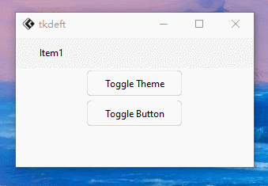

# 版本0.1.0更新！
## 新增
### *部分组件*实现切换主题时渐变

已经实现了`FluMenuBar`、`FluWindow`、`FluToggleButton`的渐变效果，但从实际效果上来看，还有不足。间接导致部分组件背景在切换后未转变回来。

实现渐变效果任重而道远。

## 修复
再之前我自己测试的时候，在某些组件中留下了自己的`print()`测试痕迹，导致使用时，会打印出无用的数据。