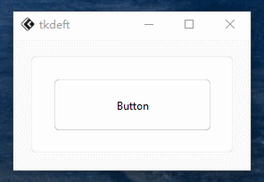

# 版本0.1.1更新！
## 新增
### *部分组件*实现切换主题时渐变

增进多实现了`FluButton`、`FluFrame(不太完善)`的渐变效果

> 不久将会实现`FluFrame`边框渐变，现在只是实现了容器组件的渐变效果，而边框还未制作，导致看的不是太流畅

## 优化

优化了下部分组件如`FluMenu`的切换主题时的刷新重绘问题，不会在重绘后出现一些奇怪的问题

> `FluMenuBar`通过`add_command`创建的项实际上是`FluButton`，因此未列入增添渐变列表

> 不过从实际上看，高速切换主题也会导致部分组件未渲染