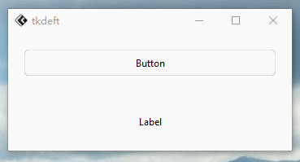

# 版本0.1.2更新！
## 新增
### *部分组件*实现切换主题时渐变
`FluLabel`实现了渐变效果


``` py title="示例1.py"
from tkflu import *

set_animation_steps(20)
set_animation_step_time(20)

root = FluWindow()

theme_manager = FluThemeManager(root)

button = FluButton(root, text="Button", mode="light", style="standard", command=lambda: theme_manager.toggle())
button.pack(padx=20, pady=20, fill="both", expand="yes")

label = FluLabel(root, text="Label", mode="light")
label.pack(padx=20, pady=20, fill="both", expand="yes")

root.mainloop()
```

### 可设置渐变动画的帧数和帧率
```python
set_animation_steps()  # 动画帧数
set_animation_step_time()  # 动画播放一帧所需的毫秒秒数
```

## 修复
1.修复了`FluToplevel`主题更改时，子组件不会执行`theme()`方法的错误。

2.修复了`FluToggleButton`渐变动画不可被`set_animation_steps()`与`set_animation_step_time()`修改的问题