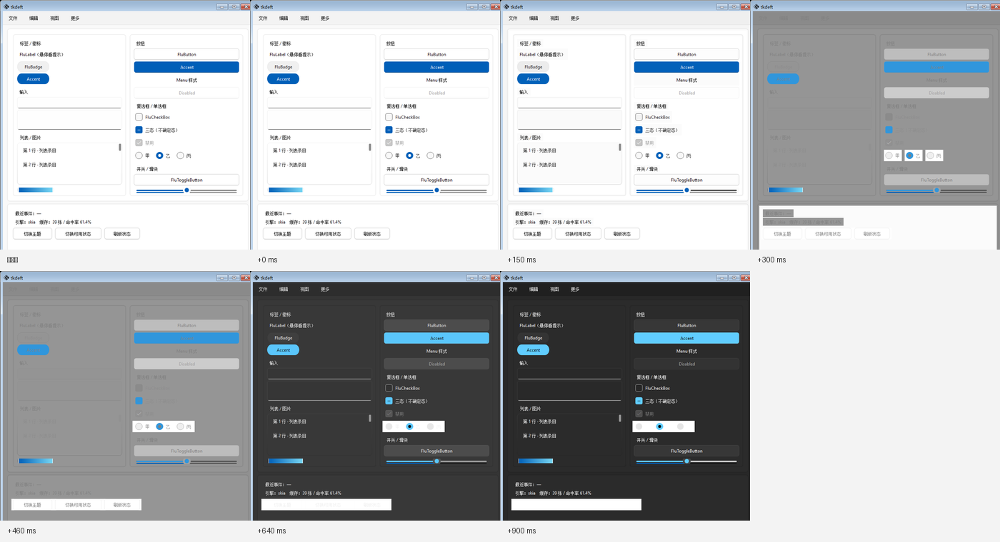

# 版本 0.5.0：一次换肤，所有组件一起变

这一版只做一件事：**把主题切换重写**。

老实现是"挨个组件换肤 + 每个组件后面跟一句 `update()`"，于是点一次
"切换主题"会卡住一两秒、组件从左到右一个一个变色、而且**动画根本看不到**。
现在整棵树共用一条时间轴，颜色是一起变的，而且 `mode()` 几乎立刻返回。

同一个组件画廊（59 个控件参与换肤，本机实测）：

| | 0.4.0 | 0.5.0 |
| --- | --- | --- |
| `mode()` 阻塞（`skia`） | 2.8 ~ 4.0 s | **≈ 30 ms** |
| `mode()` 阻塞（`tksvg`，默认引擎） | ≈ 3.3 s | **≈ 25 ms** |
| 各组件"第一次变色"的时刻差 | 150 ms 以上 | **0 ms**（同一帧） |
| 过渡中间色 | 1 种（瞬间跳变） | 3 ~ 6 种 |

**升级不需要改任何调用代码**：`FluThemeManager.mode()` / `toggle()` /
`tkflu.toggle_theme()` 的用法一个都没变。

真画廊上连拍的几帧（按窗口句柄抓的**屏幕像素**，不是属性）：

<figure markdown>
  
  <figcaption>
    同一个组件画廊（59 个控件）从浅色切到深色。+300ms / +460ms 两帧里整屏
    处在**同一个中间色**上——这就是"同步"：不存在"这一半变了、那一半还没变"。
    每张图下方标注的是离切换时刻的毫秒数。
  </figcaption>
</figure>

（生成方式：`python benchmarks/theme_transition_shots.py` 的同类脚本，
用 Win32 `PrintWindow` 按窗口句柄抓客户区，见 `benchmarks/README.md`。）

## 老实现坏在哪

```python
for widget in window.winfo_children():
    widget.theme(mode=mode)   # 每个组件内部各排各的过渡帧
    widget._draw()
    widget.update()           # ← 这一句把事件循环跑了起来
```

`update()` 会处理**全部**待办事件（含用户输入、重绘、定时器）。三个毛病
互相放大：

1. **阻塞**。组件越多这一趟越久，而且这段时间里窗口完全点不动。
2. **不同步**。每个组件的过渡各排各的 `after`，起点是"轮到它自己"那一刻；
   而前面组件的 `update()` 又把后面组件已经到点的帧就地执行掉，
   于是画面变成"一个一个地变色"。
3. **动画被吃掉**。真正跑完的帧全在那次 `mode()` 里消耗掉了，
   用户看到的不是过渡，而是"卡两秒然后瞬间变色"。

顺带一提，`FluFrame` / `FluMenuBar` / `FluToplevel` 里的递归换肤也各带一遍
`update()`，所以实际跑的事件循环次数比组件数还多。

## 现在的做法

新增 [`tkflu.theme_transition`](../../api/tkflu.theme_transition.md)，
一次换肤分三步：

1. **静默算目标**。在"组件动画全部让路"的上下文里，依次调用各组件**原有**的
   `theme()`，把目标配色写进 `attributes`。这一步的 `_draw()` 被临时屏蔽，
   所以屏幕还停在换肤前的样子——那正好就是过渡的第 0 帧。
2. **统一插值**。对每个组件做一次 `attributes` 快照，与目标值逐叶子比对，
   挑出**能插值**的叶子：`#rrggbb` 颜色按 RGB 插值，`*_opacity` 按数值插值。
   线宽、圆角、字体这类字段**直接落到目标值**——让边框"长出来"比瞬间变过去更怪。
3. **一条时间轴画所有组件**。整棵树共用一组帧，每一帧把同一个进度 `t`
   写给所有组件再统一重绘。任意时刻屏幕上所有控件都处于同一个 `t`，
   不会出现"这一半变了、那一半还没变"的撕裂。

```python
import tkflu

tkflu.run_theme_transition(root, "dark")          # 整棵子树一起过渡
tkflu.run_theme_transition(root, "dark", steps=0) # 只要结果，不要动画
```

### 顺带修掉的两个真缺陷

* **顶层就是叶子的配色字段从来没被插值过。**
  `FluLabel` 只有 `attributes.text_color`、`FluBadge` 只有 `back_color`——
  回写时对"路径长度为 1"的叶子取 `path[1:]` 得到空元组，
  插值时直接 `IndexError`，异常被兜住，于是这些组件**从不参与过渡**。
* **`pywinstyles` 内部会 `window.update()`。**
  `BWm.theme_myself()` 每次换肤都调 `pywinstyles.apply_style()`，
  而那个第三方函数里带了一句 `window.update()`——一个不在我们控制里的
  "跑一遍事件循环"。现在只在**模式真的变了**的时候才调它。

## 新增

### 缓动曲线

默认从匀速换成了 `ease_in_out`（两头慢、中间快），观感自然得多：

```python
from tkflu import easing_names, set_theme_easing

print(easing_names())
# ['ease_in', 'ease_in_out', 'ease_out', 'ease_out_back', 'linear']

set_theme_easing("ease_out")
```

### 自适应帧数：宁可少几帧，也不冻窗口

过渡的每一帧都要**重绘整棵树**，所以"能画几帧"完全取决于渲染引擎：
默认的 `tksvg` 下一屏 20 来个组件重绘一次要 100~200ms，`skia` 只要十几毫秒。
硬按 `steps × step_time` 的时间表去排，时间轴上大部分帧会被直接跳过，
用户看到的其实是"闪一下"。

所以现在先量一次重绘开销，再把**帧数降到预算以内**（默认 600ms），
第一帧实测之后还会再收紧一次：

```python
import tkflu

transition = thememanager.mode("dark")
transition.describe()
# {'mode': 'dark', 'widgets': 59, 'requested_steps': 5, 'steps': 3,
#  'frames_painted': 2, 'paint_cost_ms': 316.83, 'failures': []}

tkflu.set_transition_budget(900)   # 想要更长更顺的过渡
```

**想要丝滑就换引擎**，比加帧数有效得多：

```python
tkflu.set_renderer("skia")     # 或 "pillow"（零额外依赖）
```

### 过渡对象

```python
transition = thememanager.mode("dark")

transition.finished          # 画完了吗
transition.frames_painted    # 实际画了几帧
transition.failures          # 这次换肤里抛异常的组件（不影响其它组件）
transition.cancel()          # 中断；restore=False 可保留中间色接着切
```

连点"切换主题"不会叠加帧队列：新的过渡会**就地接管**旧的（以当前中间色为
新起点），画面是连续的。

### 按次覆盖动画参数

```python
thememanager.mode("dark", animation_steps=8, animation_step_time=16,
                  easing="ease_out")
thememanager.mode("dark", animation_steps=0)     # 这一次不要动画
```

## 改了什么行为

* `FluThemeManager.mode()` **不再在返回前画完**。它只把目标配色静默写进
  `attributes`，重绘交给事件循环；所以 `mode()` 之后立刻读 `attributes`
  已经是新主题的值，但画面还没变。要同步等结果：

  ```python
  transition = thememanager.mode("dark")
  while not transition.finished:
      root.update()
  ```

* 换肤的覆盖范围从"窗口的直接子组件 + 各容器自己向下传播"变成
  **整棵控件树**。以前需要自己写 `update_children()` 的中间层容器，
  现在什么都不用做。

* `FluWindow.theme(mode)` / `FluToplevel.theme(mode)` 现在会**连带**换掉
  整个窗口里的组件（以前只管窗口自己）。想让一个子树单独换肤时，
  直接对它调 `run_theme_transition(subtree, mode)` 即可。

## 验证

* 新增 `tests/test_theme_transition.py`（18 个用例）：同一帧里所有组件的进度
  必须相同、换肤不跑事件循环、`mode()` 返回时一帧都没画、帧数按预算裁剪、
  第二次切换接管第一次、中断/取消、坏组件不拖垮整趟换肤、缓动端点与单调性。
* 新增 `benchmarks/theme_switch_bench.py`：量 `mode()` 阻塞时长、总时长、
  最长无响应间隔、**过渡中间色帧数**与**各组件变色时刻的同步偏差**。
  上表的原始结果 JSON 与该脚本一起提交在 `benchmarks/` 里。
* 新增 `benchmarks/theme_transition_shots.py`：用 Win32 `PrintWindow`
  按窗口句柄连拍，用**屏幕上的像素**证明那段过渡真的发生了
  （面板颜色 `255 → 251 → 251 → 224 → 149 → 74 → 47`，单调变暗）。

`ruff check tkflu tests benchmarks` 清零，`python -m tkflu --check` 退出码 0，
`pytest tests` 全绿。
