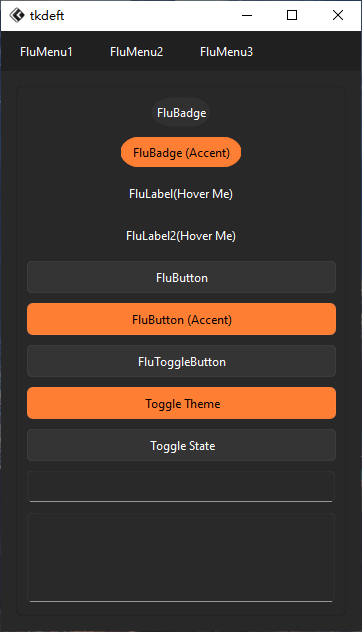

# 简单使用
如果你有一定的`tkinter`编码基础，那你上手会比较容易。

其实语法都差不太多，如下示例

=== "Tkinter"

    ```python
    import tkinter as tk
    
    root = tk.Tk()
    
    button = tk.Button(text="Button")
    button.pack()    
    
    root.mainloop()
    ```

=== "TkFluent"
    
    ``` py hl_lines="1 3 5"
    import tkflu
    
    root = tkflu.FluWindow()
    
    button = tkflu.FluButton(text="Button")
    button.pack()    
    
    root.mainloop()
    ```

可以运行示例看看所有组件长什么样
```bash
python -m tkflu
```

!!! tip "示例提示"
    
    在这个示例里，按下`Toggle Theme`按钮，可以切换主题（请不要高速点击，切换主题时，每个组件都要渲染，会有卡顿，导致部分组件主题没有渲染出来）

    按下`Toggle State`按钮，可以使`FluButton`、`FluButton(Accent)`、`FluEntry`组件失效/恢复正常

!!! note "效果展示"

    

    


## 不同点须知
`tkfluent`比`tkinter`多了`dconfig`、`dconfigure`、`dcget`、`attributes`等属性方法、参数。
这得于继承了`tkdeft.DObject`。

```py title="tkdeft/object.py"
class DObject(object):
    """
    基础对象
    """

    from easydict import EasyDict

    attributes = EasyDict(
        {
            "class": "DObject"
        }
    )

    def dconfigure(self, **kwargs):
        for attribute in self.attributes:
            if attribute in kwargs:
                self.attributes[attribute] = kwargs.pop(attribute)

    dconfig = dconfigure

    def dcget(self, key):
        if key in self.attributes:
            return self.attributes[key]
        else:
            return None
```
由于在实际继承过程中，`tkinter`中`config`的属性会被顶替掉，为了防止以后遇到什么需要的，但某个属性无法被设置，就单独有设置了属性方法。

=== "Tkinter"
    ```python
    widget.config(attribute=value)
    widget.configure(attribute=value)
    ```

    这个方法用于获取`tkinter`的属性的对应值，与`tkfluent`特有属性不连通
    ```python
    widget.cget("attribute_name")
    ```

=== "TkFluent"
    这两个方法都是一样的，用于设置独属于`tkfluent组件`的属性
    ```python hl_lines="1 2"
    widget.dconfig(attribute=value)
    widget.dconfigure(attribute=value)
    ```

    这个方法用于获取独属于`tkfluent组件`的属性的对应值
    ```python hl_lines="1"
    widget.dcget("attribute_name")
    ```