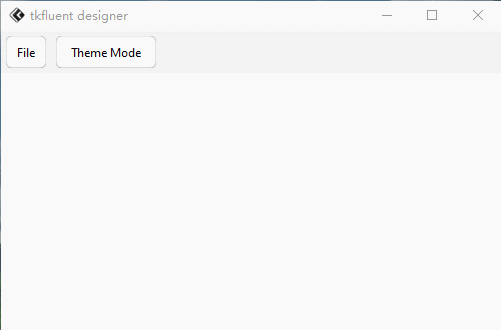

# 第一个应用程序
总所周知，实践也是学习的一种，可以提升的更快，比单单看几本书快多了

先看效果


## 窗口初步设置
```python
from tkflu import *

root = FluWindow()
root.title("tkfluent designer")
root.geometry("500x300")

root.mainloop()
```
### title
熟悉`tkinter`的都知道，`title`方法中文直译过来就是标题的意思，里面输入参数便可以设置窗口标题，但如果没给出值，将会返回标题。

### geometry
`geometry`方法可以用来设置窗口的大小、位置，但不输入不会有任何返回。

如果输入`"500x500"`则会将窗口设置长500像素，宽500像素。如果只想设置位置，只需要这样`"+500+500"`，开头加个`+`号，后面跟两个数字，第一个数字是X轴的位置，第二个是Y轴的位置。
当然两个可以合起来，既设置位置，又设置大小。只需将它们拼起来，但大小在前，位置在后，`500x500+500+500`类似这种

## 设置菜单栏
```python
menubar = FluMenuBar(root)
menubar.show()  # 实际为menubar.pack(fill="x") 只是简化了罢了
```


可见菜单栏出现在上方，只不过有点不太明显

现在来加点东西
```python
menubar.add_command(label="File", style="standard", width=40, command=lambda: print("File -> Clicked"))
```
与`tkinter.Menu`创建个菜单选项大差不差


点击后
```bash
输出：File -> Clicked
```

不过吗，不修改样式的话，本为`"menu"`样式。菜单栏的各个选项其实就是一个个`FluButton`，为了让它被嵌入菜单栏时更符合原版`sunvalley`的设计。

实现多级菜单就有点复杂了

创建一个`FluMenu`对象，再用`add_cascade`方法将`FluMenu`对象嵌入菜单栏。

这里来做个实现切换深浅主题的菜单
```python
theme_manager = FluThemeManager(root)
```

```python
menu1 = FluMenu()
menu1.geometry("90x90")
menu1.add_command(label="Light", command=lambda: theme_manager.mode("light"))
menu1.add_command(label="Dark", command=lambda: theme_manager.mode("dark"))
```

```python
menubar.add_cascade(label="Theme Mode", style="standard", width=100, menu=menu1)
```
现在就被嵌入进去了



最后再加个`关于`的菜单

```python
def func1():
    messagebox = FluToplevel()
    messagebox.geometry("300x200")

    label = FluLabel(messagebox, text="This is a example for tkfluent!", width=160, height=32)
    label.pack(anchor="center")

menubar.add_command(label="About", style="standard", width=40, command=lambda: func1())
```

!!! note ""
    
    还有一点，如果想让渐变效果更明显、慢点，可以使用`set_animation_steps()`和`set_animation_step_time()`方法
    
    ```python
    set_animation_steps(10)
    set_animation_step_time(10)
    ```


## 完整示例
```python
from tkflu import *

set_animation_steps(10)
set_animation_step_time(10)

root = FluWindow()
root.title("tkfluent designer")
root.geometry("500x300")

theme_manager = FluThemeManager(root)

menubar = FluMenuBar(root)

menu1 = FluMenu()
menu1.geometry("90x90")
menu1.add_command(label="Light", command=lambda: theme_manager.mode("light"))
menu1.add_command(label="Dark", command=lambda: theme_manager.mode("dark"))

def func1():
    messagebox = FluToplevel()
    messagebox.geometry("300x200")

    label = FluLabel(messagebox, text="This is a example for tkfluent!", width=160, height=32)
    label.pack(anchor="center")

menubar.add_command(label="File", style="standard", width=40, command=lambda: print("File -> Clicked"))
menubar.add_cascade(label="Theme Mode", style="standard", width=100, menu=menu1)
menubar.add_command(label="About", style="standard", width=40, command=lambda: func1())

menubar.show()


root.mainloop()
```
