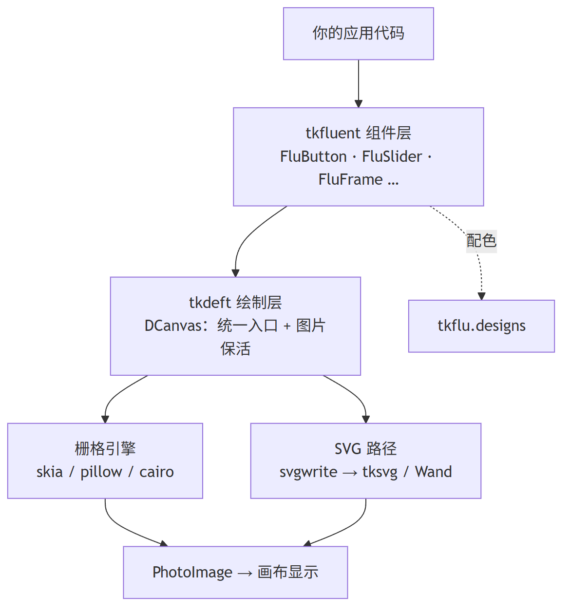
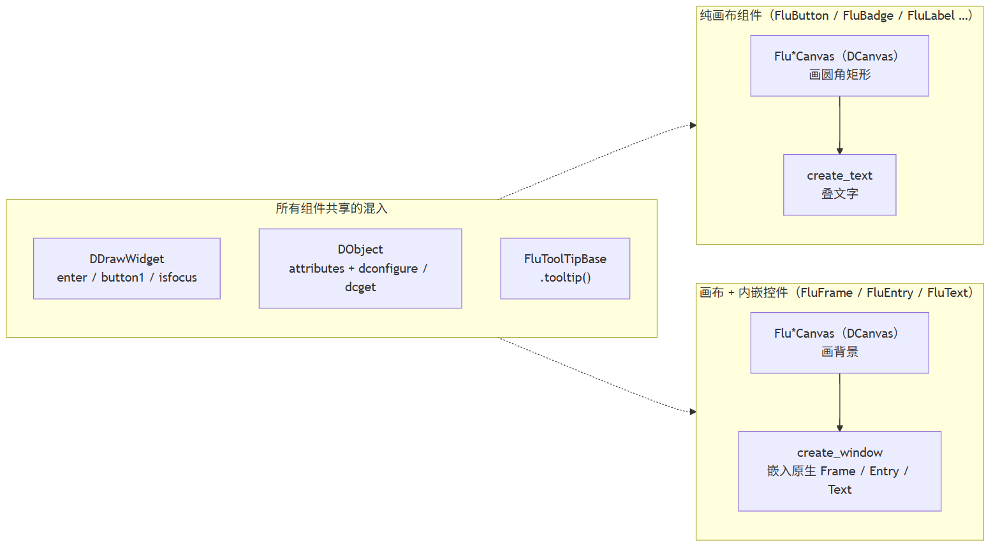
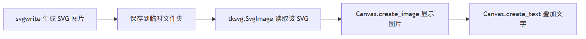
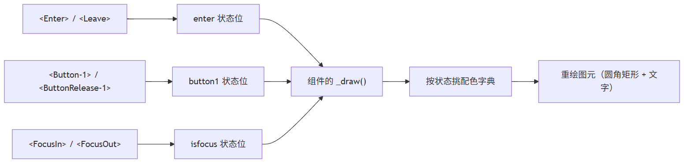
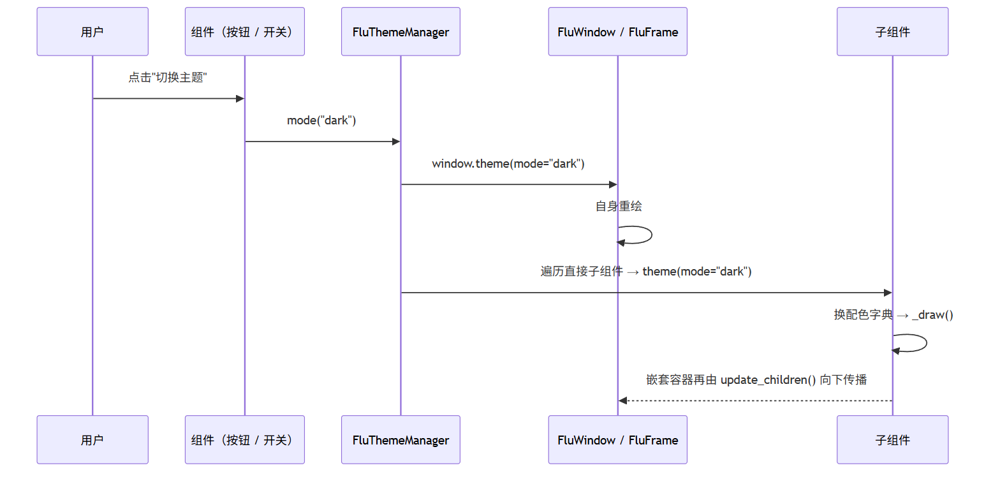

# 它是怎么搭起来的

这一页讲 tkfluent 内部的分层，读完能回答三个问题：

1. 一个组件的"外观"是从哪来的？
2. 事件是怎么变成重绘的？
3. 换引擎 / 换主题为什么不用改组件代码？

## 一、分层：tkfluent 坐在 tkdeft 上

tkfluent **自己不做绘制**。它把"画什么"描述清楚，剩下交给
[tkdeft](https://tkdeft.netlify.app/) 的绘制引擎：

<figure markdown>
  
  <figcaption>tkfluent 负责"长什么样 + 什么时候重绘"，tkdeft 负责"用什么画"</figcaption>
</figure>

| 层 | 谁 | 职责 |
| --- | --- | --- |
| 应用层 | 你的代码 | 组装窗口、绑回调 |
| 组件层 | `tkflu/` | 每个组件的 `_draw()`：画背景、叠文字、摆内嵌控件 |
| 绘制层 | `tkdeft.windows` | 统一绘制入口（栅格优先 / 自动回退 SVG）、`PhotoImage` 保活、交互骨架 |
| 引擎层 | `tkdeft.engines` | `skia` / `pillow` / `cairo` / `tksvg` / `wand`，以及按规格缓存 |

??? note "只想看结论"
    换渲染引擎是 `tkflu.set_renderer("skia")` 一句话的事，组件代码一行不改——
    因为组件只描述"圆角矩形 + 颜色"，不关心谁来栅格化。
    细节见 [渲染引擎与性能](../tutorial/renderer.md)。

## 二、一个组件由什么组成

每个组件都是"**画布 + 几个混入（mixin）**"的组合。以 `FluButton` 为例：

```python
class FluButton(FluButtonCanvas, DDrawWidget, FluToolTipBase, FluGradient):
    ...
```

| 成员 | 来自 | 给你什么 |
| --- | --- | --- |
| `FluButtonCanvas` / `DCanvas` | tkdeft | 画布本身，以及 `draw_roundrect` 这类绘制入口 |
| `DDrawWidget` | tkdeft | `enter` / `button1` / `isfocus` 状态位，事件 → 重绘的骨架 |
| `DObject` | tkdeft | `attributes` 配置字典 + `dconfigure` / `dcget` |
| `FluToolTipBase` | tkfluent | `.tooltip(text=...)` 悬浮提示 |
| `FluGradient` | tkfluent | 两个颜色之间生成过渡帧（hover/主题切换的动画） |

组件分两类，看它有没有内嵌原生控件：

<figure markdown>
  
  <figcaption>纯画布组件（按钮、徽标、标签）与"画布 + 内嵌控件"组件（面板、输入框）</figcaption>
</figure>

**为什么要内嵌原生控件**：`Canvas` 能画出漂亮的圆角背景，但**不能输入**。
所以 `FluEntry` / `FluText` 的做法是——画布画背景，再把原生的 `Entry` / `Text`
用 `create_window` 嵌进去，兼顾外观与输入行为（光标、选区、输入法都还是系统的）。

!!! warning "内嵌控件要用它自己的 API"
    `FluEntry` / `FluText` **没有**代理 `insert` / `get` 这类文本操作，
    请直接访问内嵌的原生控件：

    ```python
    entry.entry.insert(0, "你好")     # FluEntry → .entry
    text.text.insert("1.0", "你好")   # FluText  → .text
    ```

## 三、一张图是怎么画出来的

先看最经典的路径（也是这个库最初的做法）：

<figure markdown>
  
  <figcaption>svgwrite 生成圆角矩形 → tksvg 读回 → 画布显示 → 文字用 create_text 叠上去</figcaption>
</figure>

`Canvas` 画不出圆角矩形，所以背景一律用矢量图；而文字用 `create_text` 叠在图片上，
因为**在 SVG 里排版文本远比在画布里麻烦**，而且中文字体、居中、换行都不好控。

现在这条路多了一层"引擎"：同一份绘制规格既可以交给上面的 SVG 流程，
也可以交给进程内栅格引擎（不落盘）。见 [渲染引擎](../tutorial/renderer.md)。

## 四、事件是怎么变成重绘的

`DDrawWidget` 把鼠标与键盘事件翻译成状态位，再调用组件的 `_draw()`：

<figure markdown>
  
  <figcaption>事件只改状态位，真正的绘制统一发生在 _draw() 里</figcaption>
</figure>

组件只要按状态挑一份配色，剩下的交给基类。`_draw()` 里通常长这样：

```python
def _draw(self, event=None):
    super()._draw(event)                  # 同步背景色；未映射时直接返回
    if not self.winfo_ismapped():
        return
    state = self.dcget("state")
    _dict = self.attributes.hover if self.enter else self.attributes.rest
    self.delete(self.element_border)      # 先擦旧的
    self.element_border = self.create_round_rectangle(...)   # 再画新的
```

## 五、换主题的调用链

`FluThemeManager.mode()` 把整棵树交给
[`theme_transition`](../api/tkflu.theme_transition.md)，分三步：

<figure markdown>
  
  <figcaption>一键换肤：静默落目标值 → 逐叶子算插值 → 一条时间轴画完整棵树</figcaption>
</figure>

1. **静默落目标值**——在"组件动画让路 + `_draw()` 被屏蔽"的上下文里，
   依次调用各组件**原有**的 `theme(mode=...)`。配色被写进 `attributes`，
   但屏幕上还是旧样子（那正好是过渡的第 0 帧）。
2. **算插值**——对每个组件做一次 `attributes` 快照，与目标值逐叶子比对，
   挑出能插值的叶子（`#rrggbb` 颜色、`*_opacity` 数值）。
3. **一条时间轴**——整棵树共用一组帧；每一帧把同一个进度 `t` 写给所有组件，
   再统一重绘。所以颜色是"一起变"的，而不是一个一个变。

配色本身不在组件里，而在 `tkflu.designs` 包里——每个模块返回一份普通 `dict`：

```python
from tkflu.designs.button import button

button("light", "accent", "hover")
# {'back_color': '#005fb8', 'back_opacity': '0.9', ...}
```

所以**换皮肤不用碰组件代码**：改这些函数的返回值，或者用
`dconfigure(hover={...})` 覆盖某个状态。见 [主题与配色](theme.md)。

## 六、放到一起：一次 hover 发生了什么

```text
鼠标移入
  → DDrawWidget 把 enter 置 True
  → 调 FluButton._draw()
      → 从 attributes.hover 取配色
      → canvas.draw_roundrect(spec)          ← tkdeft 统一入口
          → 命中规格缓存？直接复用同一张 PhotoImage
          → 否则交给当前引擎栅格化（skia 进程内出图 / tksvg 走 SVG 文件）
      → create_image + 保活引用
      → itemconfigure 更新文字颜色
  → 界面出现悬停效果
```

## 相关阅读

| 想了解 | 看 |
| --- | --- |
| 组件有哪些、各有什么参数 | [组件总览](components.md) |
| 主题、主色调、动画 | [主题与配色](theme.md) |
| 换引擎与性能数据 | [渲染引擎与性能](../tutorial/renderer.md) |
| 底层零件（规格、引擎、画布） | [tkdeft 文档](https://tkdeft.netlify.app/) |
| 出问题了 | [常见问题与排查](faq.md) |
