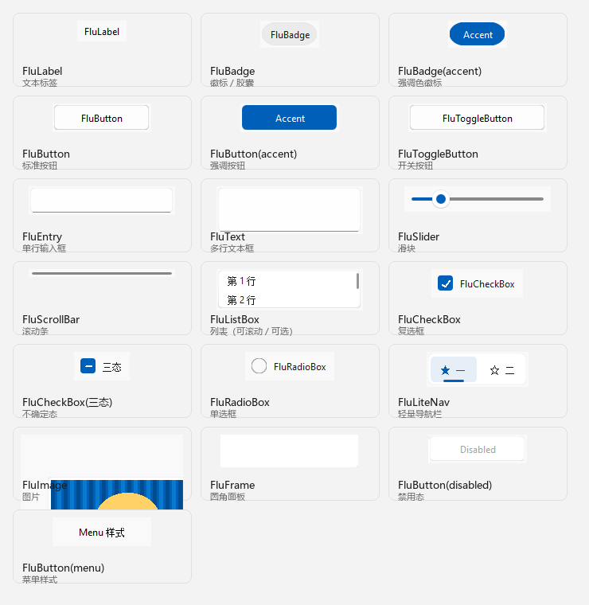
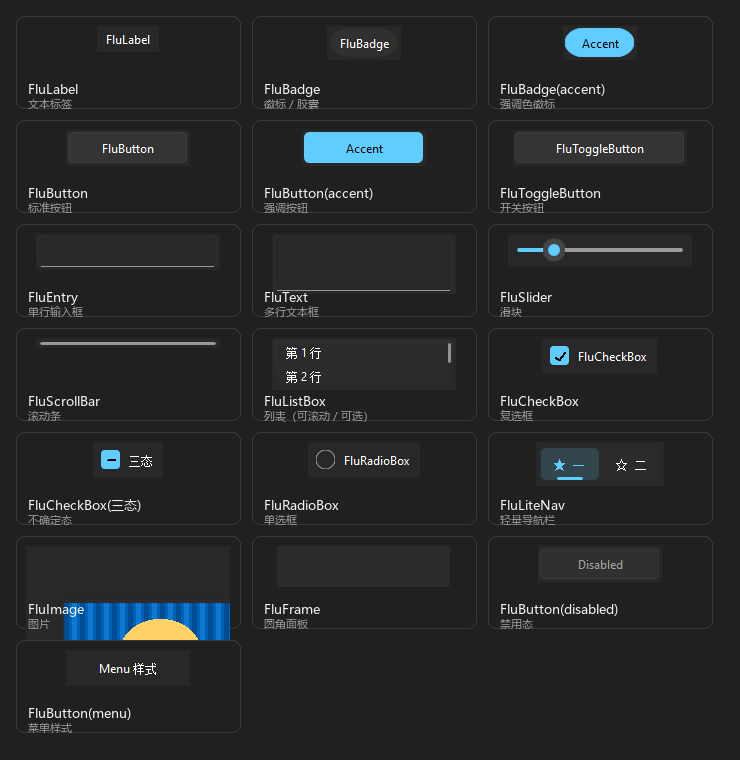
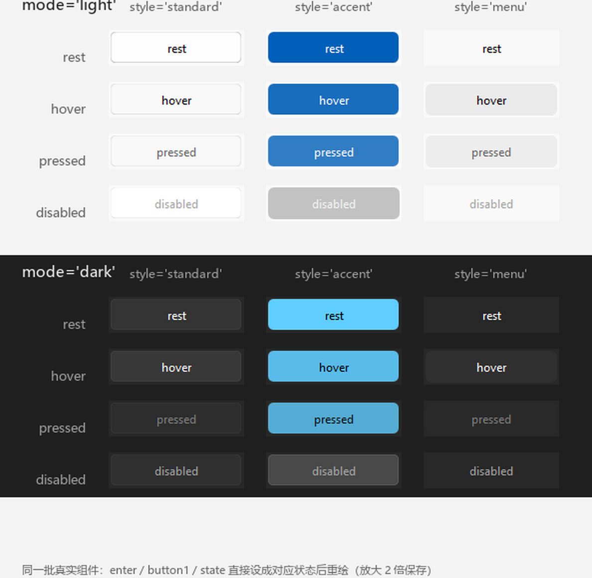

# 组件总览

所有组件都可以从包根直接导入：

```python
import tkflu
# 或者
from tkflu import FluWindow, FluButton, FluFrame
```

## 长什么样

图鉴里的每一格都是从**真实运行**的组件上截下来的（不是设计稿）：

<figure markdown>
  
  <figcaption>浅色主题下的组件图鉴</figcaption>
</figure>

<figure markdown>
  
  <figcaption>同一批组件切到深色主题：绘制层不用改，只是配色字典变了</figcaption>
</figure>

## 一览表

| 组件 | 用途 | 关键参数 |
| --- | --- | --- |
| [`FluWindow`](../api/tkflu.window.md) | 主窗口（应用根窗口） | `mode` |
| [`FluToplevel`](../api/tkflu.toplevel.md) | 子窗口 | `mode` |
| [`FluFrame`](../api/tkflu.frame.md) | 圆角面板 / 容器 | `width` `height` `mode` `style` |
| [`FluLabel`](../api/tkflu.label.md) | 文本标签 | `text` `width` `height` `font` |
| [`FluButton`](../api/tkflu.button.md) | 按钮 | `text` `style` `state` `command` |
| [`FluToggleButton`](../api/tkflu.togglebutton.md) | 开关 | `text` `command`（读 `dcget("checked")`） |
| [`FluCheckBox`](../api/tkflu.checkbox.md) | 复选框（含不确定态） | `text` `checked` `three_state` `command` |
| [`FluRadioBox`](../api/tkflu.radiobox.md) | 单选框 | `text` `value` `variable` / `group` |
| [`FluBadge`](../api/tkflu.badge.md) | 徽标 / 胶囊标签 | `text` `width` `style` |
| [`FluEntry`](../api/tkflu.entry.md) | 单行输入框 | `width` `textvariable` `state` |
| [`FluText`](../api/tkflu.text.md) | 多行文本框 | `width` `height` `state` |
| [`FluSlider`](../api/tkflu.slider.md) | 滑块 | `value` `min` `max` `orient` `tick` `changed` |
| [`FluScrollBar`](../api/tkflu.scrollbar.md) | 滚动条 | `command` `orient` `state` |
| [`FluListBox`](../api/tkflu.listbox.md) | 列表 | `items` `selectmode` `command` `on_select` |
| [`FluLiteNav`](../api/tkflu.litenav.md) | 轻量导航栏 | `items` `orient` `selected` `command` |
| [`FluImage`](../api/tkflu.image.md) | 图片 | `image`（路径 / `PhotoImage` / `PIL.Image`） |
| [`FluMenu`](../api/tkflu.menu.md) | 下拉菜单 | `add_command` / `add_cascade` |
| [`FluMenuBar`](../api/tkflu.menubar.md) | 菜单栏 | `add_command` / `add_cascade` |
| [`FluPopupMenu`](../api/tkflu.popupmenu.md) | 弹出菜单 | — |
| [`FluPopupWindow`](../api/tkflu.popupwindow.md) | 通用弹出窗口 | — |
| [`FluToolTip`](../api/tkflu.tooltip.md) | 悬浮提示 | 通过组件的 `.tooltip()` 挂载 |
| [`FluThemeManager`](../api/tkflu.thememanager.md) | 主题管理 | `mode` / `toggle` |

!!! tip "选择类控件怎么选"

    | 想要的效果 | 用哪个 |
    | --- | --- |
    | 开关式的"开 / 关" | [`FluToggleButton`](../api/tkflu.togglebutton.md) |
    | 复选（可多选、可不确定） | [`FluCheckBox`](../api/tkflu.checkbox.md) |
    | 一组里只能选一个 | [`FluRadioBox`](../api/tkflu.radiobox.md) |
    | 一组里选一个、但要滚动 / 分栏 | [`FluListBox`](../api/tkflu.listbox.md)（`selectmode="single"`） |
    | 页面/区块之间切换 | [`FluLiteNav`](../api/tkflu.litenav.md) |

## 复选框与单选框

两者都是"指示器 + 标签"的组合，键盘都能用 `Tab` 聚焦、`空格` 触发。

```python
import tkinter as tk
import tkflu

root = tkflu.FluWindow()
root.geometry("360x260")

# 复选框：checked 允许 True / False / None
box = tkflu.FluCheckBox(root, text="启用动画", checked=True)
box.pack(anchor="w", padx=14, pady=6)

three = tkflu.FluCheckBox(root, text="三态（不确定）", three_state=True, checked=None)
three.pack(anchor="w", padx=14, pady=6)

# 单选框：同一个 variable 自动互斥
plan = tk.StringVar(master=root, value="b")
for key, title in (("a", "方案 A"), ("b", "方案 B"), ("c", "方案 C")):
    tkflu.FluRadioBox(root, text=title, variable=plan, value=key).pack(
        anchor="w", padx=14, pady=4
    )

def on_change():
    print("动画：", box.dcget("checked"), " 方案：", plan.get())

box.dconfigure(command=on_change)
root.mainloop()
```

不想自己建变量时，可以给一组单选框起同一个**组名**：

```python
tkflu.FluRadioBox(root, text="甲", group="plan", value="a")
tkflu.FluRadioBox(root, text="乙", group="plan", value="b")
```

`group` 会在同一个窗口内共享一个变量，窗口销毁时自动回收。

## 列表

`FluListBox` 自己绘制条目，只画**可见的那几行**（虚拟滚动），
所以放几千条也不会卡。选中行左侧有一条强调色指示条，
右侧的滚动条可以拖动、也可以滚轮滚。

```python
import tkflu

root = tkflu.FluWindow()
root.geometry("360x320")

box = tkflu.FluListBox(
    root,
    width=300,
    height=180,
    items=[f"第 {i} 行" for i in range(1, 101)],
    selectmode="extended",          # single / multiple / extended
    command=lambda index, item: print("激活", index, item),
    on_select=lambda indices, items: print("选中", indices),
)
box.pack(padx=16, pady=16)

box.insert("end", "新加的")
box.select(2)
box.see(50)
print(box.selection(), box.get(2))
root.mainloop()
```

| 方法 | 说明 |
| --- | --- |
| `insert(index, item)` / `append(item)` | 插入 / 追加条目 |
| `delete_item(index)` / `clear()` | 删除一条 / 清空 |
| `get(index)` / `index(item)` | 取条目 / 取下标 |
| `select` `deselect` `select_all` `clear_selection` | 改选择 |
| `selection()` / `curselection()` | 取当前选中的下标元组 |
| `see(index)` / `yview(...)` | 滚动 |
| `activate(index)` | 触发 `command` |

!!! warning "条目删除叫 `delete_item`，不叫 `delete`"

    控件本身是一个 `tkinter.Canvas`，`delete` 是"删除画布元素"的意思
    （重绘时第一件事就是 `self.delete("all")`）。两者同名会递归调用自己。

## 导航栏

`FluLiteNav` 是一排可点条目 + 一个选中项：竖排时指示条在左，横排时在下方。

```python
import tkflu

root = tkflu.FluWindow()
root.geometry("420x160")

nav = tkflu.FluLiteNav(
    root,
    items=[
        ("🏠", "首页"),
        ("🔍", "搜索"),
        {"label": "设置", "icon": "⚙", "key": "settings"},
    ],
    orient="horizontal",     # 或 "vertical"
    style="card",            # standard = 透明底
    selected="settings",
)
nav.pack(padx=16, pady=16)

nav.dconfigure(command=lambda index, item: print("切到", item["key"]))
nav.add_item("关于", icon="ℹ", key="about")
root.mainloop()
```

条目可以是 `"标签"`、`("图标", "标签")` 或字典
（`label` / `icon` / `key` / `enabled` / `command`）。

## 最小示例

```python
import tkflu

root = tkflu.FluWindow(mode="light")
root.geometry("360x260")

frame = tkflu.FluFrame(root, width=320, height=220)
frame.pack(fill="both", expand=True, padx=15, pady=15)

tkflu.FluLabel(frame, text="你好，tkfluent").pack(anchor="w", padx=10, pady=(10, 4))

tkflu.FluButton(frame, text="点我", command=lambda: print("clicked")).pack(
    fill="x", padx=10, pady=4
)

entry = tkflu.FluEntry(frame, width=280)
entry.pack(fill="x", padx=10, pady=4)

root.mainloop()
```

## 按钮的三种样式

`FluButton` 的样式与状态组合起来共 12 种外观（`mode` 再翻一倍）。下图是
**同一批真实按钮**分别被设成 `rest` / `hover` / `pressed` / `disabled` 后重绘的结果：

<figure markdown>
  
  <figcaption>4 状态 × 3 样式，浅色与深色各一组（放大 2 倍）。悬停与按压只是透明度不同，这是 Fluent 的设计</figcaption>
</figure>

```python
import tkflu

root = tkflu.FluWindow()

tkflu.FluButton(root, text="standard").pack(padx=10, pady=4)
tkflu.FluButton(root, text="accent", style="accent").pack(padx=10, pady=4)
tkflu.FluButton(root, text="menu", style="menu").pack(padx=10, pady=4)
tkflu.FluButton(root, text="disabled", state="disabled").pack(padx=10, pady=4)

root.mainloop()
```

## 开关与状态读取

`FluToggleButton` 的选中状态存在组件的 `attributes` 里，用 `dcget` 读取：

```python
toggle = tkflu.FluToggleButton(root, text="启用")

def on_toggle():
    print("当前状态：", toggle.dcget("checked"))

toggle.dconfigure(command=on_toggle)
```

同样的 `dcget` / `dconfigure` 也适用于其他组件（它们是
`tkdeft.object.DObject` 提供的统一配置接口）：

```python
button.dconfigure(text="新的文字", state="disabled")
print(button.dcget("state"))     # 'disabled'
```

## 挂提示

任何继承 `FluToolTipBase` 的组件都能挂一个 Fluent 风格的提示：

```python
label = tkflu.FluLabel(root, text="把鼠标放上来")
label.tooltip(text="我是提示")
```

## 标签的宽度自适应

`FluLabel` 是一块固定尺寸的画布，文本在中间居中绘制。文本一旦比画布宽，
**左右两侧都会被裁掉**。

从 `0.2.0` 起，**不传 `width`** 时标签会按文本自动撑开（只增不减，
避免文字变化时抖动）：

```python
# 自动宽度：文字多长，标签就多宽，不会被裁
tkflu.FluLabel(root, text="FluLabel（悬停看提示）")

# 显式指定宽度：行为与旧版一致，超出仍然会裁
tkflu.FluLabel(root, text="...", width=120)
```

需要动态改文字时同理，改完调一次 `_draw()` 让它重新量宽：

```python
label.dconfigure(text="一段更长的文字")
label._draw()
```

## 容器怎么用

`FluFrame` 内部是"画布 + 子 Frame"的结构，但它把 `pack` / `grid` / `place`
都代理给了内部画布，所以你可以像用普通容器一样用它：

```python
frame = tkflu.FluFrame(root, width=300, height=200)
frame.pack(padx=10, pady=10)

tkflu.FluButton(frame, text="在面板里").pack(padx=8, pady=8)
```

## 想直接看效果

```bash
python -m tkflu
```

会打开一个把所有组件摆在一起的画廊，详见 [运行演示](run-demo.md)。
