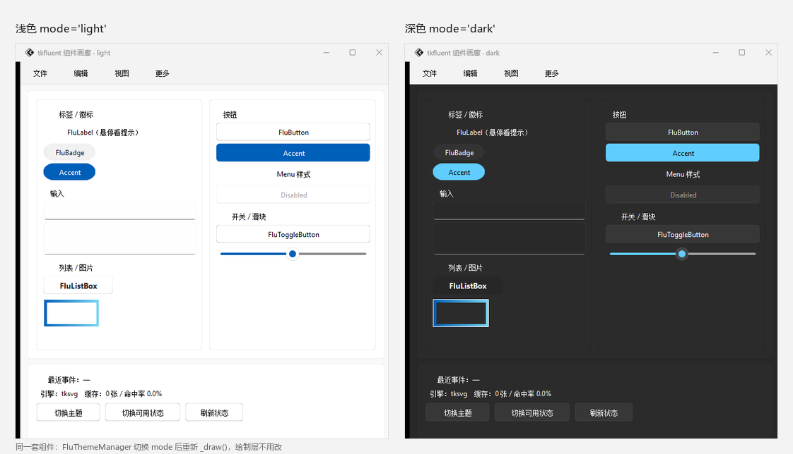

# 主题与配色

tkfluent 的主题体现在三个层次：**窗口级深浅模式**、**全局主色调**、
**单个组件的样式**。三者可以独立使用。

## 一、深浅模式

同一个界面在两套配色下的样子（`FluThemeManager` 切换，绘制层不改一行）：

<figure markdown>
  
  <figcaption>左：<code>mode='light'</code>；右：<code>mode='dark'</code></figcaption>
</figure>

### 单个组件

每个组件在构造时接受 `mode`：

```python
tkflu.FluButton(root, text="浅色", mode="light")
tkflu.FluButton(root, text="深色", mode="dark")
```

### 整个窗口

`FluWindow` 也有 `mode`，但**它不会自动递归**改子组件。
批量切换请用 `FluThemeManager`：

```python
import tkflu

root = tkflu.FluWindow(mode="light")
thememanager = tkflu.FluThemeManager(window=root, mode="light")

tkflu.FluButton(root, text="切换主题", command=thememanager.toggle).pack()

root.mainloop()
```

或者配合开关组件：

```python
toggle = tkflu.FluToggleButton(root, text="深色模式")
toggle.dconfigure(command=lambda: tkflu.toggle_theme(toggle, thememanager))
```

`FluThemeManager.mode()` 会走完窗口的**整棵控件树**（不分层级、自动去重），
把每个持有配色的组件都切到目标模式。**组件挂多深都不影响**——
嵌套面板、菜单栏里的菜单项、列表 / 导航栏都会被覆盖到，
不需要你手写 `update_children()` 之类的向下传播。

## 二、全局主色调

强调色（`style="accent"` 的按钮、开关等）取的是一个全局主色调，
提供 6 个预设：

```python
import tkflu

tkflu.blue_primary_color()     # 默认
tkflu.red_primary_color()
tkflu.orange_primary_color()
tkflu.yellow_primary_color()
tkflu.green_primary_color()
tkflu.purple_primary_color()
```

也可以自己指定一对颜色（浅色模式用第一个，深色模式用第二个）：

```python
from tkflu import set_primary_color

set_primary_color(("#005fb8", "#60cdff"))
```

!!! note "改完要重绘"
    主色调是**读取时取值**，已经画好的组件不会自动变色。
    改完之后需要重新 `theme()` 或 `_draw()`，最简单是重启界面：

    ```python
    tkflu.purple_primary_color()
    # 已存在的强调色按钮需要重画才会生效
    button.theme(mode="light", style="accent")
    ```

## 三、单组件样式

`FluButton` 有三种样式：

```python
tkflu.FluButton(root, text="standard")                  # 默认：浅色描边
tkflu.FluButton(root, text="accent", style="accent")    # 强调色填充
tkflu.FluButton(root, text="menu", style="menu")        # 无边框菜单项
```

`FluFrame` 有两种：

```python
tkflu.FluFrame(root, style="standard")     # 普通面板
tkflu.FluFrame(root, style="popupmenu")    # 弹出菜单用的面板
```

## 四、组件的四种状态

每个交互组件的配色由 `(mode, style, state)` 决定，其中 `state` 有四档：

| 状态 | 触发时机 |
| --- | --- |
| `rest` | 常态 |
| `hover` | 鼠标悬停 |
| `pressed` | 按下 |
| `disabled` | `dconfigure(state="disabled")` |

想改某个状态的配色，可以覆盖组件自己的状态字典：

```python
button = tkflu.FluButton(root, text="自定义悬停色")
button.dconfigure(hover={
    "back_color": "#ffe0e0",
    "back_opacity": 1,
    "border_color": "#ff0000",
    "border_color_opacity": 1,
    "border_color2": None,
    "border_color2_opacity": None,
    "border_width": 1,
    "radius": 6,
    "text_color": "#a00000",
})
button._draw()
```

## 五、过渡动画 {: #transition-animation }

主题切换的渐变过渡由两个全局参数控制：

```python
from tkflu import set_animation_steps, set_animation_step_time

set_animation_steps(5)        # 过渡帧数
set_animation_step_time(20)   # 每帧间隔（毫秒）
```

两者都设为 `0`（默认值）即关闭过渡。

### 所有组件走同一条时间轴

一次换肤里，**整棵树共用一条时间轴**：每一帧把同一个进度 `t`（0 → 1）
写给所有组件，然后统一重绘。因此颜色是"一起变"的，不会出现
"这个按钮已经变完、旁边那个还没动"。

这条时间轴由 [`theme_transition`](../api/tkflu.theme_transition.md) 驱动，
也可以直接调：

```python
from tkflu import run_theme_transition

run_theme_transition(root, "dark")               # 整棵子树一起过渡
run_theme_transition(root, "dark", steps=0)      # 只要结果，不要动画
run_theme_transition(root, "dark", easing="linear")
```

`FluThemeManager.mode()` 还可以**按次覆盖**全局设置：

```python
thememanager.mode("dark", animation_steps=8, animation_step_time=16, easing="ease_out")
thememanager.mode("dark", animation_steps=0)     # 这一次不要动画
```

### 缓动曲线

默认是 `ease_in_out`（两头慢、中间快），比匀速自然得多。可选：

```python
from tkflu import easing_names, set_theme_easing

print(easing_names())
# ['ease_in', 'ease_in_out', 'ease_out', 'ease_out_back', 'linear']

set_theme_easing("ease_out")     # 快起慢落
```

### 帧数会按渲染开销自动裁剪

主题过渡的**每一帧都要重绘整棵树**，所以"能画几帧"完全取决于渲染引擎：
默认的 `tksvg` 下一屏 20 来个组件重绘一次要 100~200ms，而 `skia` 只要十几毫秒。

因此实际帧数由**预算**决定，而不是硬按 `steps × step_time` 的时间表去排：

* 库先抽几个组件量一次重绘开销，估算整棵树要多久；
* 再把帧数**降**到能塞进预算的数量——宁可少几帧，也要每一帧都完整、同步；
* 第一帧实测之后还会再收紧一次，所以抽样估偏也不会拖长。

预算默认 **600ms**，可以调：

```python
from tkflu import set_transition_budget

set_transition_budget(900)     # 想要更长更顺的过渡
set_transition_budget(0)       # 不限制（渲染慢时会真的变慢）
```

!!! tip "想要丝滑就换渲染引擎"
    过渡是否顺滑，主要取决于**一次全树重绘要多久**。
    在 `tksvg` 上加帧数收效甚微，换个栅格引擎立竿见影：

    ```python
    import tkflu

    tkflu.set_renderer("skia")     # 或 "pillow"（零额外依赖）
    ```

    详见 [渲染引擎](../tutorial/renderer.md)。

### `mode()` 不会阻塞

`FluThemeManager.mode()` **不会**在返回前把过渡跑完，也不会去跑事件循环
（早期版本在每个组件后面调了一次 `update()`，组件一多就会"卡两秒然后瞬间变色"）。
它只做两件事：静默地把目标配色写进各组件的 `attributes`，
然后把重绘交给事件循环。所以从点击到界面响应之间的延迟，只有几十毫秒。

过渡对象本身也能用：

```python
transition = thememanager.mode("dark")

transition.finished          # 画完了吗
transition.frames_painted    # 实际画了几帧
transition.describe()        # 一句话说明这次过渡实际发生了什么
transition.cancel()          # 中断（restore=False 可以保留中间色接着切）
```

连点"切换主题"不会叠加帧队列：新的过渡会**就地接管**旧的，
并以当前中间色作为新起点，画面是连续的。

## 六、设计规范在哪

组件"长什么样"集中在 `tkflu.designs` 包里，每个模块返回一份普通的 `dict`：

```python
from tkflu.designs.button import button

button("light", "accent", "hover")
# {'back_color': '#005fb8', 'back_opacity': '0.9', ...}
```

所以**换皮肤不需要改组件代码**，改这些函数的返回值即可。
每个模块的取值说明见 [设计规范 API](../api/tkflu.designs.md)。
