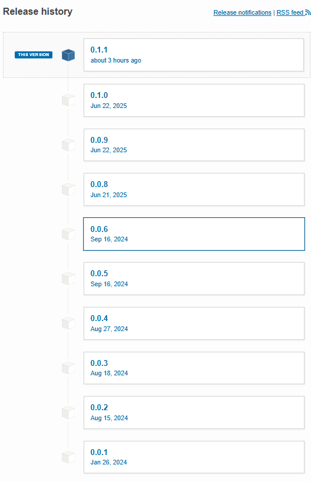
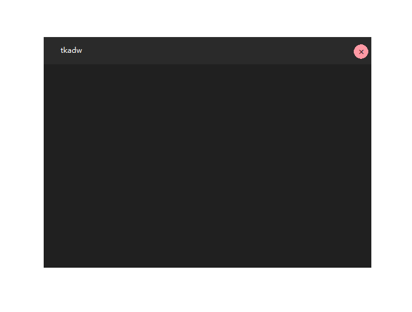
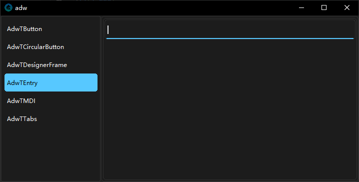

# 关于tkfluent

## 前言

这个项目首次启用，大概在`2024年1月多`，但由于我当时是一位`初中生`，还有繁重的学业要弄，便搁置下来。偶尔更新几次。



如今我终于是中考完，毕业了，暑假这段时间有大把时间来编程。

## 设计

### tkfluent 的原理

`tksvg`可以在`tkinter`显示`svg`图片，然后有了个灵感，生成个`svg`图片，然后用`tksvg`将其显示在画布上。

!!! note ""
    其实早在几年前，大概`2023年`时就有这个想法，但是由于不太熟悉`Python`、`tkinter`，导致`svg`迟迟也无法显示到窗口上，后面就放弃了。
    现在才发现原来是需要实例化`SvgImage`才能让它不被销毁。

<figure markdown>
  
  <figcaption>一张圆角矩形图片的诞生：生成 SVG → 读回 → 画布显示 → 文字用 create_text 叠上去</figcaption>
</figure>

!!! example "比如 FluButton"

    因为`tkinter`的`Canvas`组件无法实现圆角矩形，所以只能用`svg`图片实现；
    而用 svg 画文本比较麻烦（中文字体、居中、换行都不好控），
    所以圆角矩形走图片、文字用`Canvas.create_text`叠上去。

    ```python
    # 相当于 FluButton._draw() 里做的事
    self.element_border = self.create_round_rectangle(0, 0, w, h, radius, ...)  # 背景
    self.element_text = self.create_text(w / 2, h / 2, text="按钮", anchor="center")
    ```

    这条流水线在 0.2.0 之后多了一层"可插拔引擎"：同样的绘制规格也可以交给
    进程内栅格引擎（skia / pillow / cairo），不再落盘。见
    [渲染引擎与性能](../tutorial/renderer.md)。

### 内部结构

想了解组件是怎么拼出来的（画布 + 混入、事件怎么变成重绘、换主题的调用链），
见 [它是怎么搭起来的](../guide/architecture.md)。

### 作者的前项目 tkadwite

我曾经做过`tkadwite`项目，这也是个`tkinter`界面扩展库，但做到后面有点难受，因为里面的组件都是用`tkinter.Canvas`来绘制的，明显锯齿这个原因一直都在，圆角矩形的渐变、阴影都是座座大山，难以增进画面效果。



不过下面这种图片的效果，这个版本至今也没发布出来


