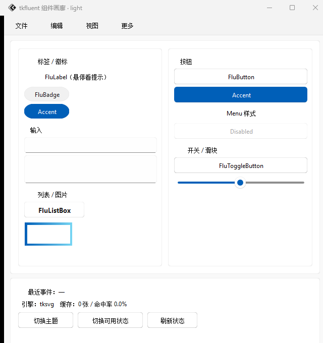

# tkfluent ( `tkflu` )

`tkfluent` 是现代化 `tkinter` 第三方界面库，设计采用 `winui3` 的
`sunvalley`（或 `fluent`）设计。

!!! info "前身"

    `tkfluent` 原本是 `tkdeft` 的默认模板界面库，后面又单独移出

    [点击查阅 *tkdeft* 文档](https://tkdeft.netlify.app/){ .md-button .md-button--primary }

<figure markdown>
  
  <figcaption>把全部组件摆在一起的画廊：<code>python -m tkflu</code>（浅色主题）</figcaption>
</figure>

## 先看这里

<div class="grid cards" markdown>

-   :material-rocket-launch: **安装与第一个窗口**

    ---

    两条命令就能跑起来

    [:octicons-arrow-right-24: 开始使用](getstarted/easytouse.md)

-   :material-view-grid: **组件总览**

    ---

    有哪些组件、各自的关键参数与外观

    [:octicons-arrow-right-24: 组件总览](guide/components.md)

-   :material-sitemap: **它是怎么搭起来的**

    ---

    分层、组件内部结构、事件与主题的走向

    [:octicons-arrow-right-24: 架构说明](guide/architecture.md)

-   :material-play-circle: **运行演示**

    ---

    `python -m tkflu` 把所有组件摆在一起

    [:octicons-arrow-right-24: 运行演示](guide/run-demo.md)

-   :material-speedometer: **渲染引擎与性能**

    ---

    切换 skia / pillow / cairo，按钮重绘快约 39 倍

    [:octicons-arrow-right-24: 渲染引擎](tutorial/renderer.md)

-   :material-lifebuoy: **出问题了**

    ---

    14 条真实踩过的坑，按症状查

    [:octicons-arrow-right-24: 常见问题](guide/faq.md)

</div>

## 所有组件一眼看完

<figure markdown>
  
  <figcaption>组件图鉴（浅色）：每一格都是从真实运行的组件上截下来的，
  完整版与深色版见 <a href="guide/components.md">组件总览</a></figcaption>
</figure>

## 支持的组件

| 组件 | 简述 | 可用程度 |
| --- | --- | --- |
| [FluBadge](api/tkflu.badge.md)（FluChip） | 徽章组件 | :white_check_mark:完善 |
| [FluButton](api/tkflu.button.md)（FluPushButton） | 按钮组件 | :white_check_mark:完善 |
| FluCheckBox | 多选框组件 | :no_entry_sign:暂未开始制作 |
| FluRadioBox | 单选框组件 | :no_entry_sign:暂未开始制作 |
| [FluEntry](api/tkflu.entry.md)（FluTextInput） | 输入框组件 | :white_check_mark:较为完善 |
| [FluFrame](api/tkflu.frame.md)（FluPanel） | 容器组件 | :white_check_mark:较为完善 |
| [FluImage](api/tkflu.image.md) | 图片组件 | :white_check_mark:基础可用 |
| [FluLabel](api/tkflu.label.md) | 标签组件 | :white_check_mark:完善 |
| [FluListBox](api/tkflu.listbox.md) | 列表组件 | :warning:占位实现，无列表能力 |
| [FluMenuBar](api/tkflu.menubar.md) | 菜单栏组件 | :white_check_mark:较为完善 |
| [FluMenu](api/tkflu.menu.md) | 嵌套在菜单栏的菜单组件 | :warning:较为不足 |
| [FluPopupMenu](api/tkflu.popupmenu.md) | 弹出菜单组件 | :white_check_mark:较为完善 |
| [FluPopupWindow](api/tkflu.popupwindow.md) | 弹出窗口 | :white_check_mark:较为完善 |
| [FluScrollBar](api/tkflu.scrollbar.md) | 滚动条组件 | :white_check_mark:基础可用 |
| [FluSlider](api/tkflu.slider.md) | 滑块组件 | :white_check_mark:较为完善 |
| [FluText](api/tkflu.text.md)（FluTextBox） | 文本编辑框 | :white_check_mark:较为完善 |
| [FluToggleButton](api/tkflu.togglebutton.md) | 切换按钮组件 | :white_check_mark:完善 |
| [FluToolTip](api/tkflu.tooltip.md) | 工具提示组件 | :white_check_mark:较为完善 |
| [FluToplevel](api/tkflu.toplevel.md)（FluSubWindow） | 子窗口组件 | :white_check_mark:较为完善 |
| [FluWindow](api/tkflu.window.md)（FluMainWindow） | 主窗口组件 | :white_check_mark:较为完善 |

!!! note "关于 FluListBox"

    `FluListBox` 目前只是一个"长得像按钮的圆角矩形"，
    **还没有列表数据与选择能力**，暂不建议用于生产。
    保留它是为了固定 API 形状，后续会补齐虚拟滚动与多选。

## 快速示例

```python
import tkflu

root = tkflu.FluWindow(mode="light")
root.geometry("360x260")

frame = tkflu.FluFrame(root, width=320, height=220)
frame.pack(fill="both", expand=True, padx=15, pady=15)

tkflu.FluLabel(frame, text="你好，tkfluent").pack(anchor="w", padx=10, pady=(10, 4))
tkflu.FluButton(frame, text="点我", command=lambda: print("clicked")).pack(
    fill="x", padx=10, pady=4
)
tkflu.FluEntry(frame, width=280).pack(fill="x", padx=10, pady=4)

root.mainloop()
```

## 文档结构

| 章节 | 内容 |
| --- | --- |
| [Get Started 开始](getstarted/download.md) | 安装、上手、第一个应用 |
| [Guide 指南](guide/components.md) | 组件总览、**架构说明**、主题与配色、运行演示、**常见问题排查** |
| [Tutorial 教程](tutorial/renderer.md) | 渲染引擎、主题切换、提示气泡 |
| [API 文档](api/index.md) | 由源码 docstring 自动生成 |
| [更新日志](blog/index.md) | 每个版本新增/修复了什么（也在这里发开发记录） |

## 版本与状态

| | |
| --- | --- |
| 当前版本 | `0.3.0`（与底层 [tkdeft](https://tkdeft.netlify.app/) 同步发版） |
| 底层依赖 | `tkdeft >= 0.2.0`（渲染引擎层） |
| 无界面自检 | `python -m tkflu --check`（退出码 0 = 通过，CI 可用） |
| 变更记录 | [更新日志](blog/index.md) |

完整的版本变更（新增了什么、修掉了什么、升级要注意什么）都在
[更新日志](blog/index.md)里，按时间倒序排列。
