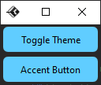

# 修改主题模式（深浅模式）

## 深入理解主题模式设计

在现代应用程序开发中，支持深浅双主题模式已成为用户体验的基本要求。`TkFluent`通过`FluThemeManager`提供了灵活的主题管理能力，让开发者能够轻松实现这一功能。

### 主题模式的核心概念

1. **视觉一致性**：确保应用在两种模式下都保持专业外观
2. **色彩对比度**：浅色模式需要足够的对比度，深色模式需要减少眩光
3. **自适应组件**：所有UI元素应能自动适应主题变化

## 主题模式
共有两个模式，一个`Light`，一个`Dark`

 Light

 Dark

## 修改主题模式
修改主题模式可以使用以下方法

导入方法并实例一个主题管理器（需要在创建主窗口之后实例）
```python
from tkflu.thememanager import FluThemeManager
thememanager = FluThemeManager()
```
设置主题模式
```python
thememanager.mode("light")  # 浅色模式
thememanager.mode("Light")  # 浅色模式，这样输入也行
thememanager.mode("dark")  # 深色模式
thememanager.mode("Dark")  # 深色模式，这样输入也行
```
其中`color1`为浅色主题时的主题色，`color2`为深色主题时的主题色

## 扩展（切换主题的按钮）
导入组件、方法
```python
from tkflu import FluToggleButton, toggle_theme
```

```python
tbtn = FluToggleButton(
    text="Toggle Theme", command=lambda: toggle_theme(tbtn, thememanager)
)
```

完整升级版实例
```python
from tkflu import FluWindow, FluButton, FluToggleButton, FluThemeManager, toggle_theme, ACCENT

root = FluWindow()

theme_manager = FluThemeManager(root)
toggle_button = FluToggleButton(
    text="Toggle Theme", command=lambda: toggle_theme(toggle_button, theme_manager)
)
toggle_button.pack(padx=3, pady=3, )

button = FluButton(root, text="Accent Button", style=ACCENT)
button.pack(padx=3, pady=3, )

root.mainloop()
```

